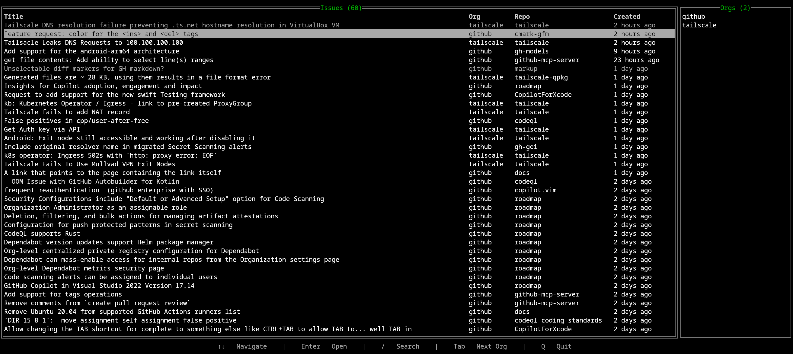

# 🐛 Bugbox


[](https://raw.githack.com/wiki/shaunmolloy/bugbox/coverage.html)

Bugbox is a fast, terminal-based Git issue inbox — solving a problem for tracking issues across multiple orgs.

Before, you would need to find issues by organisation. With Bugbox, you can track all your issues in one place.



---

## Features

- **List all issues**: Quickly view GitHub issues across multiple orgs and repos.
- **Polling**: Automatic polling for the latest open issues.
- **Open Issues in Browser**: Directly open issues in your default browser from the terminal.
- **Opened Issues marked as Read**: Automatically mark opened issues as read.
- **Search for Issues**: Search for issues using a built-in search bar.
- **Filter Issues by Org**: Supports filtering issues by GitHub organization names.

---

## Install

### From Releases

Install package from releases page:  
https://github.com/shaunmolloy/bugbox/releases

### With Go

```bash
go install github.com/shaunmolloy/bugbox@latest
```

---

## Usage

```bash
bugbox
```

---

## Configuration

Run setup to configure your GitHub token and select the organizations you want to track:

```bash
bugbox setup
```

Config files are saved to `~/.config/bugbox/`.

---

## Debugging

If you encounter any issues, you can find more detailed logs by running:

```bash
cat ~/.local/share/bugbox/bugbox.log
```

---

## License

This project is licensed under the MIT License. See the [LICENSE](LICENSE) file for details.
